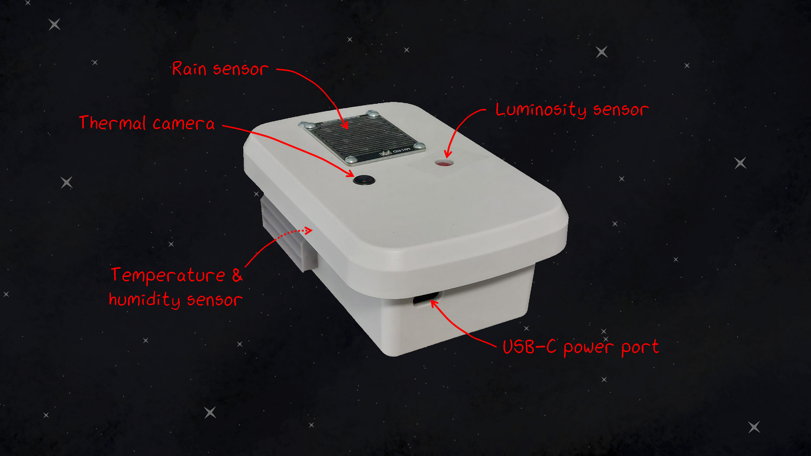

# AstroWeatherStation

**AstroWeatherStation** is an open-source weather station that aims at providing a low-cost (~100€) alternative to commercial ones. It also offers full flexibility to how your data are stored and accessed, as well as the possibility to add whatever sensor you want.

To leave a telescope outside permanently (under a dome, or with a waterproof telescope), one needs a weather station to observe the environmental conditions. This allows the telescope to be put in a safe mode if they are dangerous (e.g. rain or dew), or simply to know if observation is possible (absence of clouds).




## Features

AstroWeatherStation hosts multiple different sensors:
* DHT22: Temperature and humidity sensor
* MH-RD: Rain sensor
* MLX90640 110deg: IR Thermal camera (for cloud detection)
* TSL2591: Luminosity sensor (for start/end of observation at dawn/dusk and darkness of night measurement)

It uses the [Grove ecosystem](https://wiki.seeedstudio.com/Grove_System/) to easily connect sensors without any soldering. Sensors that don't use this ecosystem (like the TSL2591 and the MH-RD sensors) can still be connected by using the appropriate adapter cables. AstroWeatherStation uses an ESP32 controller with the Grove Shield and the Grove I2C hub which provides plenty of ports to connect sensors (digital, analog, I2C, UART).


## Hardware

| Component | Quantity | Price | Description |
| :-: | :-: | :-: | :-: |
| [XIAO ESP32-C6 board](https://www.seeedstudio.com/Seeed-Studio-XIAO-ESP32C6-Pre-Soldered-p-6328.html) | 1 | 5.30€ | Controller |
| [Grove Shield](https://www.seeedstudio.com/Grove-Shield-for-Seeeduino-XIAO-p-4621.html) | 1 | 3.90€ | Shield for the ESP32 board |
| [Grove I2C Hub](https://www.seeedstudio.com/Grove-I2C-Hub-6-Port-p-4349.html) | 1 | 1.50€ | Additional I2C ports |
| [DHT22 sensor](https://www.seeedstudio.com/Grove-Temperature-Humidity-Sensor-Pro-AM2302-DHT22.html) | 1 | 7.00€ | Temperature & humidity sensor |
| [MLX90640 110deg](https://www.seeedstudio.com/Grove-Thermal-Imaging-Camera-IR-Array-MLX90640-110-degree-p-4334.html) | 1 | 43.00€ | IR Thermal camera |
| [MH-RD sensor](https://www.berrybase.ch/fr/detail/019234a3bb007361a022dfc33cb3b6cc) | 1 | 1.90€ | Rain sensor |
| [TSL2591 sensor](https://www.berrybase.ch/adafruit-tsl2591-high-dynamic-range-digitaler-licht-sensor) | 1 | 7.50€ | Luminosity sensor |
| [CHD7310WH enclosure](https://www.camdenboss.com/camden-boss/chd7310wh-73-series-ip68-waterproof-enclosure%2C-white%2C-asa-ul94hb%2C-150x100x55mm/c-23/p-24506) | 1 | 25.40€ | Waterproof enclosure |
| [Grove cable](https://www.seeedstudio.com/Grove-Universal-4-Pin-Buckled-20cm-Cable-5-PCs-pack.html) | 3 | 1.70€ | Sensor connection |
| [Grove-Jumper cable](https://www.seeedstudio.com/Grove-4-pin-Female-Jumper-to-Grove-4-pin-Conversion-Cable-5-PCs-per-PAck.html) | 1 | 3.00€ | MH-RD sensor connection |
| [Grove-Qwiic cable](https://www.berrybase.ch/sparkfun-qwiic-grove-adapterkabel-100mm) | 1 | 2.00€ | TSL2591 sensor connection
| [USB-C cable](https://www.berrybase.ch/en/detail/019234a6a33a7045b0129025e8e15021) | 1 | 2.80€ | Power cable
| [Stevenson screen](/hardware/3d-printing/) | 4 | 3D printed | Rain-proof ventilation for inside sensors |
| [MLX90640 support](/hardware/3d-printing/MLX90640%20Support.3mf) | 1 | 3D printed | Support for the MLX90640 thermal camera |
| [TSL2591 support](/hardware/3d-printing/TSL2591%20Support.3mf) | 1 | 3D printed | Support for the TSL2591 sensor |
| [Base plate](/hardware/laser-cutting/Base%20plate.dxf) | 1 | Laser cut | Base plate to hold the electronics


## Code

### ESP32

The weather station is controlled by an ESP32 board ([XIAO ESP32-C6 model](https://www.seeedstudio.com/Seeed-Studio-XIAO-ESP32C6-p-5884.html)). The code, written in MicroPython, for it can be found in [this folder](code/esp32/). It hosts:
* [`boot.py`](code/esp32/boot.py): The booting code which connects the weather station to a WiFi network. If no known network is found, it will host its own WiFi network where you will be able to setup the connection.
* [`main.py`](code/esp32/main.py): The main code that reads the sensor values and upload their values to the `index.html` page.
* [`index.html`](code/esp32/index.html): The raw HTML page that shows the sensor values of the weather station. It is formatted to be used by the [WeatherWatcher INDI library](https://indilib.org/weather/weather-watcher.html), but it can be easily used with an other standard.
* Libraries: [`mlx90640.py`](code/esp32/mlx90640.py), [`tsl2591.py`](code/esp32/tsl2591.py), [`wifimgr.py`](code/esp32/wifimgr.py)
* Test code for individual sensors: [`test_dht22.py`](code/esp32/test/test_dht22.py), [`test_mhrd.py`](code/esp32/test/test_mhrd.py), [`test_mlx90640.py`](code/esp32/test/test_mlx90640.py), [`test_tsl2591.py`](code/esp32/test/test_tsl2591.py)

### RaspberryPi

The weather station publishes its sensor values to an HTML page on the WiFi network to which it is connected. The [`log_astroweatherstation.py`](code/raspberrypi/log_astroweatherstation.py) program recovers the sensor values from this page and sends them to an InfluxDB database to store them. From there, they can be plotted in Grafana for example. This code also saves the IR thermal camera data as an image and in a log file for post-processing.

* To install InfluxDB and Grafana on a RaspberryPi, follow [this tutorial](https://sandyjmacdonald.github.io/2021/12/29/setting-up-influxdb-and-grafana-on-the-raspberry-pi-4/).

* To run the logging code on your RaspberryPi every minute to log the weather station data, you can use the `crontab -e` command and add the following line, where `<PATH-TO-FILE>` should be changed with the absolute path to the Python file:

    ```
    */1 * * * * /usr/bin/python3 <PATH-TO-FILE>/log_astroweatherstation.py &
    ```

## References

* [`wifimgr.py`](https://github.com/tayfunulu/WiFiManager) by [Tayfun ULU](https://github.com/tayfunulu): WiFi manager library *(MIT License)*
* [`tsl2591.py`](https://github.com/mchobby/esp8266-upy/tree/master/tsl2591) by [MCHobby](https://github.com/mchobby): MicroPython library for TSL2591 luminosity sensor *(MIT License)*
* Auto-gain for `tsl2591.py` by [Aurélien Genin](https://github.com/AstroAure) *(MIT License)*
* [`mlx90640.py`](https://github.com/michael-sulyak/micropython-mlx90640) by [Michael Sulyak](https://github.com/michael-sulyak): MicroPython library for MLX90640 IR thermal camera *(MIT License)*